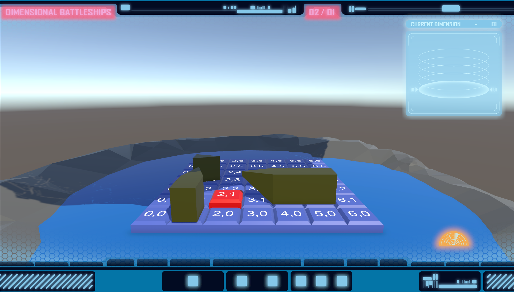
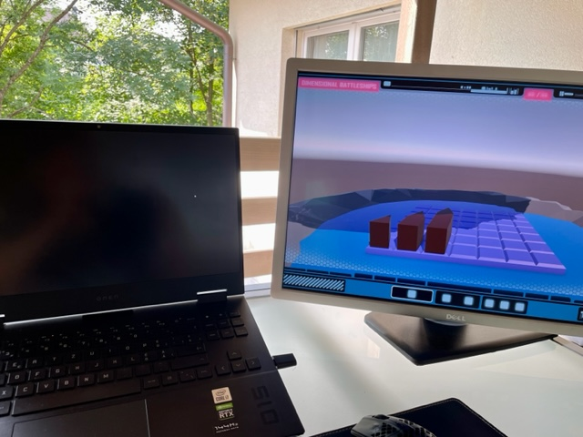

# DIMENSIONAL WAREFARE
A local multiplayer game on PC with controllers.

## Welcome at DIMENSIONAL WAREFARE
This website is all about DIMENSIONAL WAREFARE, a game, that I started to build in a modul while studying IT and design at the Lucern University of Applied Siences and Arts. Because I faild to implement the core game play completly, I'd like to finish it in this mentoring project. In a talk with my mentor Guillaume Massol I decided on three goals to achive until the end of this semester.

### Goals
1. Complete implementation of the core game play on one dimension
   * [x] Collision detection
   * [x] Hit detection
   * [x] Ships can sink
   * [x] Exclude sunk ships from further game 
3. Simple orientation and overview for players
   * [x] Visually show status of ships: activated/inactive, hit, sunk
   * [x] Zoom out to show all dimensions and ships at once
5. Learn more about Unity
   * [x] Debugging in Unity
   * [x] Information handling for classes

## Starting point
Up until now, you can play the start phace of DIMENSIONAL WAREFER and you can shoot at your opponents fleet, even there isn't a hit detection implemented yet. If you are courious about the building process until here, you can read about it on the game blog of Digital Ideation.  
[Game blog Digital Ideation, author: Melanie Gmünder](https://blog.hslu.ch/games/author/melaniegmuender/)  
  
<video width="100%" height="100%" controls="controls">
  <source src="video/video1.mp4" type="video/mp4">
</video> 

## 15.05.2023
Fixed turn issues

## 16.05.2023
Added hit detection: [hit detection](https://github.com/gmume/DIMENSIONAL_WAREFARE/blob/b192315552d55c617ce58b3fca6f982090e2abf0/Assets/Scripts/Fleet/Ship.cs#L139-L157)
<!-- https://github.com/gmume/DIMENSIONAL_WAREFARE/blob/b192315552d55c617ce58b3fca6f982090e2abf0/Assets/Scripts/Fleet/Ship.cs#L139-L157 -->

## 17.05.2023
Users can now see better, which ship is selected in the HUD and on the dimension.
<video width="100%" height="100%" controls="controls">
  <source src="video/video2.mp4" type="video/mp4">
</video> 

## 06.06.2023
Updated player swap: https://github.com/gmume/DIMENSIONAL_WAREFARE/blob/3d4b39d8474e041904f6eb93e2e17264be6164cf/Assets/Scripts/Fleet/Fleet.cs#L32-L48  
Active ships and cells are now working correctly.
Added script Player: https://github.com/gmume/DIMENSIONAL_WAREFARE/blob/ec4bcb8cd7c0edb313a01de77ddd0aab843572b2/Assets/Scripts/Multiplayer/Player.cs#L7-L53  
It holds all informations about the player, that other classes may need. Therefore it isn't necessary to set all properties separately in them anymore. 
Refactored properties.

## 06.06.2023
Refacturing: Transfered PlayerData, dimensions and fleet to Player.

## 12.06.2023
Hit detection works: https://github.com/gmume/DIMENSIONAL_WAREFARE/blob/bd3cd517bc873adbe7f385ca48d7aa1b0ca7dbaf/Assets/Scripts/Fleet/Ship.cs#L161-L168  
Added ship status log: https://github.com/gmume/DIMENSIONAL_WAREFARE/blob/262fe4d342022bae5d95c4ff2f1b77b89727b644/Assets/Scripts/Fleet/Ship.cs#L18-L36

## 22.06.2023
New bug detected. Coordinates of active cells and ships are not the same on hitting a ship.
<video width="100%" height="100%" controls="controls">
  <source src="video/video3.mp4" type="video/mp4">
</video> 
Finally, it's working again.
Hit ships get now visible and collision course detection was added: https://github.com/gmume/DIMENSIONAL_WAREFARE/blob/c71a91cbb8dd109cf5c662931051f3876bb639cc/Assets/Scripts/Fleet/Ship.cs#L64-L107  
<video width="100%" height="100%" controls="controls">
  <source src="video/video4.mp4" type="video/mp4">
</video> 

## 23.06.2023
Added win condition "fleet destroyed": https://github.com/gmume/DIMENSIONAL_WAREFARE/blob/a7df79bd1ee52a57d985663e4498a18ae0f2ebb6/Assets/Scripts/Fleet/Ship.cs#L204-L218

## 25.06.2023
Players can now zoom out to get a better view over all dimensions.
<video width="100%" height="100%" controls="controls">
  <source src="video/video5.mp4" type="video/mp4">
</video> 
Ships, that arrive an upper dimension, can be placed new.
<video width="100%" height="100%" controls="controls">
  <source src="video/video6.mp4" type="video/mp4">
</video> 

## 26.06.2023
Ships come in different sizes.

## 27.06.2023
Updated ships occupying cells, collision course and hit detection:  
https://github.com/gmume/DIMENSIONAL_WAREFARE/blob/f3879ca1a22d26fdc9b4a5170396c9ff16e34e9a/Assets/Scripts/Fleet/Ship.cs#L105-L121  
https://github.com/gmume/DIMENSIONAL_WAREFARE/blob/f3879ca1a22d26fdc9b4a5170396c9ff16e34e9a/Assets/Scripts/Fleet/Ship.cs#L138-L172  
https://github.com/gmume/DIMENSIONAL_WAREFARE/blob/f3879ca1a22d26fdc9b4a5170396c9ff16e34e9a/Assets/Scripts/Fleet/Ship.cs#L228-L243  
https://github.com/gmume/DIMENSIONAL_WAREFARE/blob/f3879ca1a22d26fdc9b4a5170396c9ff16e34e9a/Assets/Scripts/Fleet/Ship.cs#L284-L340

## 28.06.2023
Sunk ships respawn on lower dimension, if they aren't already on thie lowest dimension: https://github.com/gmume/DIMENSIONAL_WAREFARE/blob/84e771b4d6fc81b92fcee3b712299bd8aac5148e/Assets/Scripts/Fleet/Ship.cs#L339-L368

## 29.06.2023
First display shows black screen in build mode fixed.  
  
Implemented prioritized initialization of classes: https://github.com/gmume/DIMENSIONAL_WAREFARE/blob/cf6c6f409116eb64204ef174a103e70bb9e8ba5b/Assets/Scripts/Multiplayer/PlayerWorld.cs#L55-L62

